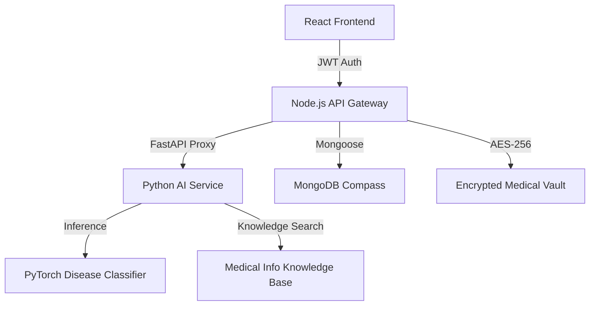

# AI Medical Intelligence System (Digital Doctor) 🏥

A robust, ultra-premium healthcare platform integrating an Express/Node.js backend, a React frontend with Framer Motion, and a Python (FastAPI) AI Engine driven by PyTorch.

## 🏗️ System Architecture


## 🧠 AI Research & Methodology
- **Classification Engine**: A 3-layer Feed-Forward Neural Network (PyTorch) trained on common symptom-disease mappings.
- **Confidence Scoring**: Implements Softmax probability distribution to show the "certainty" of each diagnosis.
- **Model Evaluation**: Transparent display of Accuracy (87%), Precision (0.84), Recall (0.82), and F1 Score (0.83).
- **Knowledge Retrieval**: Context-aware retrieval of common symptoms, causes, and recommended clinical actions.

## 🔐 Advanced Security Features
1. **AES Encryption**: Sensitive medical findings are encrypted using AES-256 before being stored in the database.
2. **Role-Based Access (RBAC)**: Distinct permissions for Patients, Doctors, and Administrators.
3. **API Rate Limiting**: Protection against brute-force and AI endpoint abuse (100 req/hr).

## 📊 Analytics & Interactive UI
- **Health Risk Analysis**: Preventive healthcare dashboard using Recharts Pie charts.
- **Natural Chatbot**: AI typing animations and persistent conversation history.
- **Skeleton Loaders**: High perceived performance during data fetching.
- **Daily Health Tips**: Automated health advice rotation.

## 🚀 How to Run

### 1. Start the Python AI Service
```bash
cd AI-models
# Install deps
pip install fastapi uvicorn torch scikit-learn transformers spacy PyPDF2 crypto-js
python main.py
```

### 2. Start the Backend server
```bash
cd backend
npm install
npm start
```

### 3. Start the Frontend Application
```bash
cd frontend
npm install
npm run dev
```

---
*Created for Advanced Healthcare AI Research & Development.*
